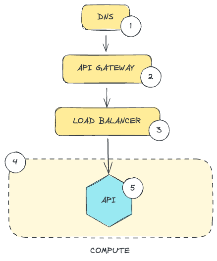

This page contains a high-level overview of the API I created for this
project.

Let's take a very high-level look at the overall design:

---

import { Aside, Card, LinkCard, Steps } from "@astrojs/starlight/components";

<Steps>

1. #### DNS

   The API is hosted at: https://api.y4ni.com

   The role of the DNS component is to resolve the DNS name above so
   we can route traffic to the API server.

   For this project, I used [AWS Route53] to implement the
   DNS component.

    

2. #### API Gateway

   Once the DNS name has been resolved, the traffic is routed to the
   API Gateway component. This performs several important functions:

   <LinkCard
     title="Authentication"
     description="Go to authentication page"
     href="../../decisions/decisions/"
   />

   <LinkCard
     title="Usage Restrictions"
     description="Go to an overview of usage restrictions"
     href="../../decisions/decisions/"
   />

    

</Steps>
